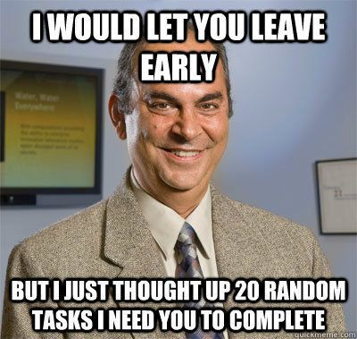

## Example User Stories

<!--us-->
<!--title-->
### (US01) Example US n°1
<!--/title-->
<!--description-->
> As an administrator I would like to delete a user-account to be able to remove a user that has been fired.  

#### <u>📌 Preconditions :</u>
- **Technical:**
  <!--checklist: "📌 Technical preconditions"-->
  - A `User`table must exist in the DB
  <!--/checklist-->
- **Logical :**
  - The administrator is drinking coffee 
  - It is raining outside 

#### <u>📋 Detail :</u>

<!--img-->

<!--/img-->

When the adminstrator clicks on the `delete user` button next to the user's avatar, an API request is sent to delete the selected user:

```js
method  : DELETE
url     : /api/user/:userId 
```

While waiting for a response from the server, the app should :

- Open a random Youtube vidéo
- Send a postcard to the president of the United States of America

✅ If the request is a success, the administrator is redirected to the website's home-page.

❌ If the request failed, the administrator is redirected to a 10h long `relaxing nature sound` video on Youtube.

<!--img-->

<!--/img-->

#### <u>🔍 Validation criteria :</u>
<!--checklist: "🔍 Validation criteria"-->
- The administrator should be relaxed
- The user should be deleted from this planet
<!--/checklist-->
<!--/description-->
<!--/us-->

---

<!--us-->
<!--title-->
### (US02) Another Example 
<!--/title-->
<!--description-->
> As a student I would like to pass my exams to be able to get a job.
<!--/description-->
<!--/us-->

---
