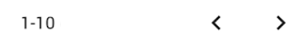

## Générale (G)

<!--us-->
<!--title-->
### (G01) Connexion utilisateur 2
<!--/title-->
<!--description-->
> En tant que personne non-connectée j'aimerais pouvoir me connecter afin d'avoir accès au fonctionnalités de la web-app. 

#### <u>📌 Préconditions :</u>
- **Technique :**
  <!--checklist: "📌 Préconditions technique"-->
  - table `User` doit exister
  - Test
  <!--/checklist-->
- **Logique :**
  - l'utilisateur doit exister (avoir été créé au préalable)

#### <u>📋 Détail :</u>
Quand la personne navigue vers l'URL du site-web, il arrive sur une page de login contenant un formulaire avec les champs suivant :

- Username: `texte` 
- Password: `texte` 
- Login : `bouton`

Lorsqu'il clique sur le bouton *Login* une requête `POST` est envoyé à l'API afin de tenter d'authentifier l'utilisateur :

```json
method  : POST
url     : /api/login
body    :
{
    "Username": "aaaaaaa",
    "Password": "*******"
}
```

<!--img-->

<!--/img-->

✅ Si l'utilisateur existe et que le mot de passe est correcte, un token JWT doit être renvoyé et l'utilisateur est re-dirigé vers sont dashboard. 

❌ Si la requête échoue: 

- les deux champs texte tremble brièvement
- la bordure des champs texte est rouge
- le champ *Password* est vidé
- un message d'erreur est affiché en dessous du champ *Password* indiquant l'erreur de connexion.

<!--img-->

<!--/img-->

#### <u>🔍 Critères de validation :</u>
  <!--checklist: "🔍 Critères de validation"-->
  - Une personne ayant entré un mauvais *Username* et/ou mauvais *Password* ne sait pas se connecter
  - Une personne ayant entré un *Username* et un *Password* correcte est connecté et est redirigé vers son dashboard. 
  <!--/checklist-->

<!--/description-->
<!--/us-->

---

<!--us-->
<!--title-->
### (G02) Ajout/Création utilisateur en tant qu'admin
<!--/title-->
<!--description-->
> En tant qu'utilisateur Admin j'aimerais pouvoir créer/ajouter un compte utilisateur de n'importe quel type (A,D,M,C) afin de accorder l'accès à l'application et de donner des droits à certaines personnes.
<!--/description-->
<!--/us-->

---